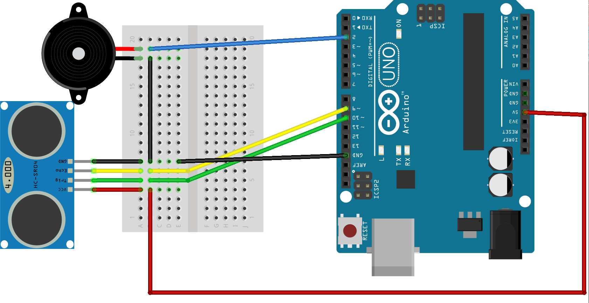

# Aleksander Andzel Projekt Technika Mikroprocesorowa
Nazwa projektu: Ultradźwiękowy wykrywasz przeszkód

# Wstęp:
Projekt składa się z płytki UNO ATmega328P-AU Arduino połączonej do breadboard'a na którym przyłączony został głośnik (buzzer) oraz odległościowy czujnik ultradźwiękowy. 
Działanie układu polega na uruchomieniu sygnału dźwiękowego z głośnika gdy tylko czujnik wykryje obiekt w odległości 0,5 metra.

# Wykorzystane elementy:
- płytka UNO ATmega328P-AU Arduino
- breadboard
- buzzer 5V 12mm - THT
- ultradźwiękowy czujnik odległości HC-SR04

# Projekt schematyczny z programu Fritzing:


# Krótka prezentacja działania programu:
https://www.youtube.com/watch?v=WYWlnuSujS8

# Kod programu:
```cpp
// Definicja pinów dla buzzera i czujnika
int const trigPin = 10;
int const echoPin = 9;
int const buzzPin = 2;

void setup()
{
  pinMode(trigPin, OUTPUT); // wyjście impulsowe dla pinu trig
  pinMode(echoPin, INPUT); // echo pin odpowiedzialny za szerokość impulsu
  pinMode(buzzPin, OUTPUT); // wyprowadzenie do sterowania buzzerem
}

void loop()
{
  int czas, odleglosc;	// czas to szerokość impulsu wejściowego a odleglosc to odległość od przeszkody 
  digitalWrite(trigPin, HIGH);	// Impuls wyjściowy na trigPin
  delay(1);
  digitalWrite(trigPin, LOW);
  czas = pulseIn(echoPin, HIGH);	// Pomiar impulsu na echoPin
  odleglosc = (czas/2) / 29.1;		// odległość to połowa czasu trwania podzielona przez 29,1 
    if (odleglosc <= 50 && odleglosc >= 0) {	 // zastosowanie pętli if która pozostawia buzzer w spoczynku / aktywuje go
      // Aktywacja buzzera
      digitalWrite(buzzPin, HIGH);
    } else {
      // Buzzer nie aktywny
      digitalWrite(buzzPin, LOW);
    }
    delay(60);
}

```